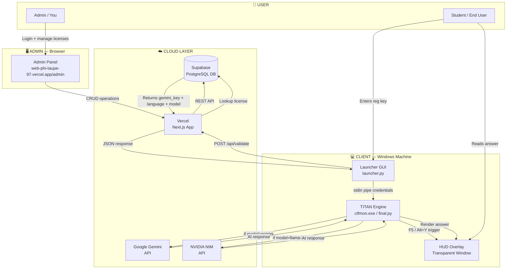
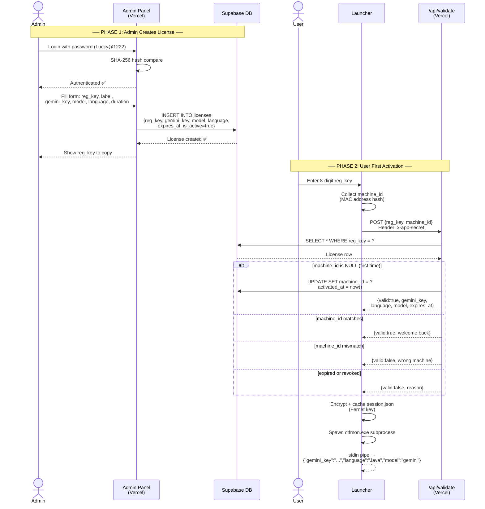
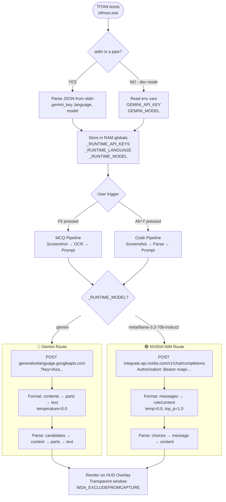
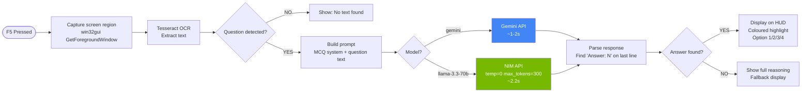
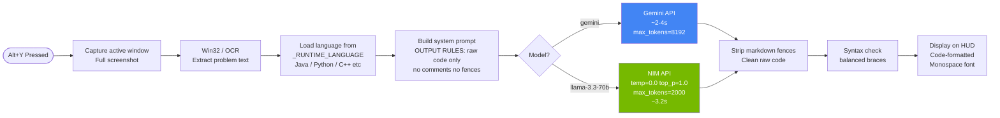
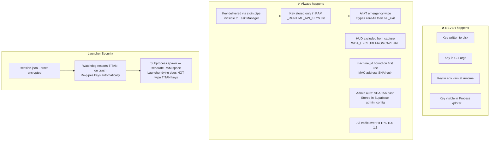
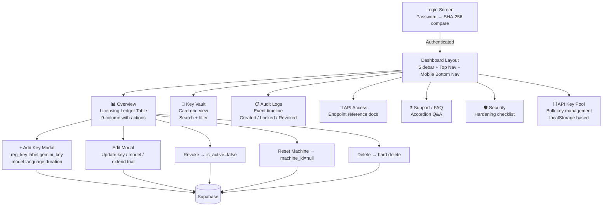
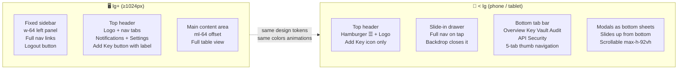
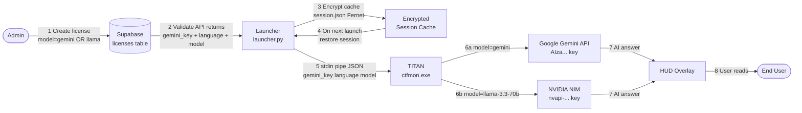

# TITAN Ecosystem — Full Visual Workflow
> Version 2.0 | Multi-Model AI | Hardware-Locked Licensing

---

## 1. 🗺️ 30,000-Foot View — The Full Ecosystem

---

## 2. 🔐 License Lifecycle — Admin Creates → User Activates

---

## 3. 🤖 Model Routing — How TITAN Picks the AI

---

## 4. 🧠 MCQ Pipeline — Screenshot to Answer

---

## 5. 💻 Coding Pipeline — Problem to Code

---

## 6. 🛡️ Security Architecture

---

## 7. 🖥️ Admin Panel — Page & Action Map

---

## 8. 📱 Responsive Layout — Desktop vs Mobile

---

## 9. 🔄 End-to-End Data Flow Summary

---

## 10. ⚡ Performance Benchmarks

```mermaid
gantt
    title AI Response Time Comparison (tested 2026-05-12)
    dateFormat X
    axisFormat %ss

    section Gemini
    MCQ response        :0, 2
    Code response       :0, 4

    section Llama 3.3 70B (NIM)
    MCQ response        :0, 3
    Code response       :0, 4

    section Failed Models
    Minimax m2.7        :crit, 0, 120
    GLM 4.7             :crit, 0, 120
    DeepSeek V4 Flash   :crit, 0, 128
```

| Model | MCQ | Code | Key Format | Status |
|-------|-----|------|-----------|--------|
| **Gemini 2.5 Flash** | ~1-2s | ~2-4s | `AIza...` | ✅ Production |
| **Llama 3.3 70B (NIM)** | ~2.2s | ~3.2s | `nvapi-...` | ✅ Production |
| Minimax m2.7 | 120s timeout | 120s | nvapi- | ❌ Removed |
| GLM 4.7 | 120s timeout | 120s | nvapi- | ❌ Removed |
| DeepSeek V4 Flash | 120s timeout | ~128s | nvapi- | ❌ Removed |

---

*Generated automatically from session audit · TITAN v2.0 · 2026-05-12*
