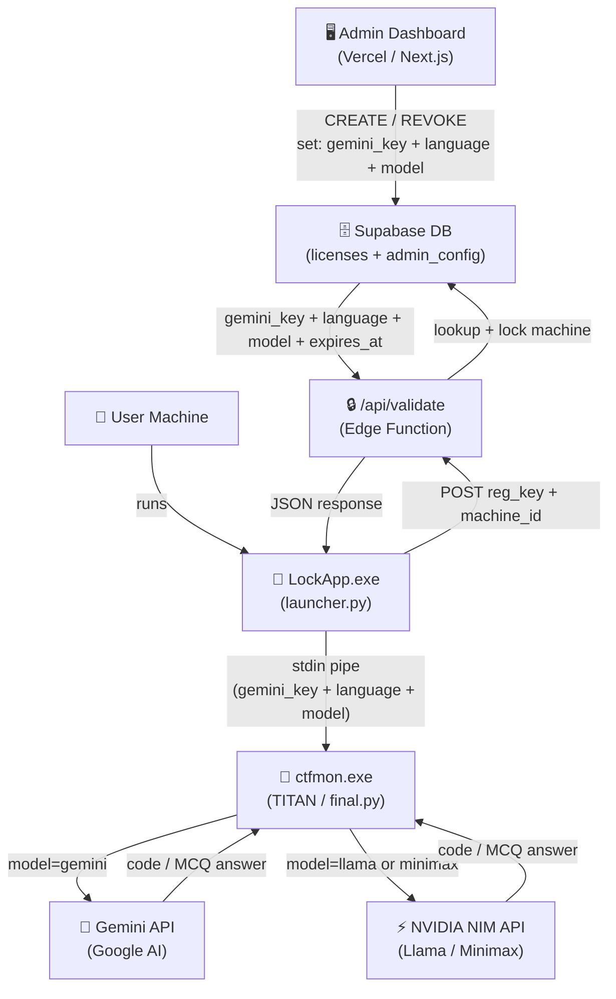
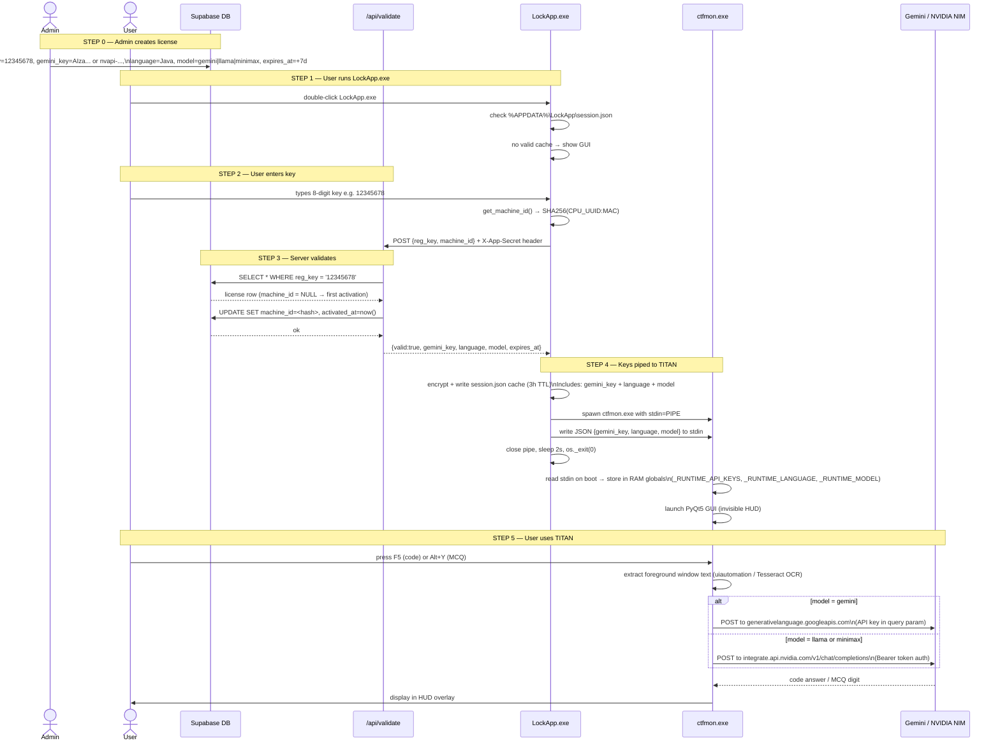
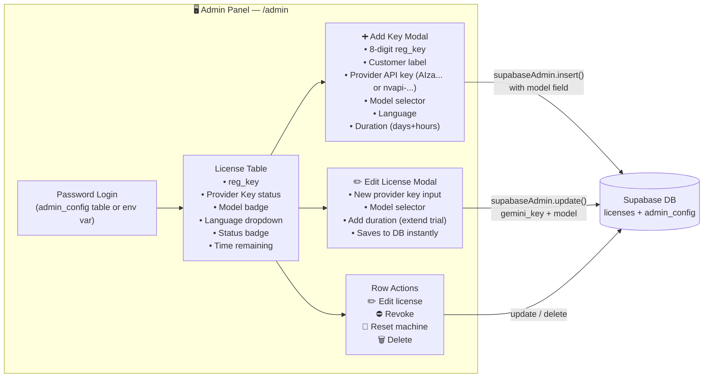
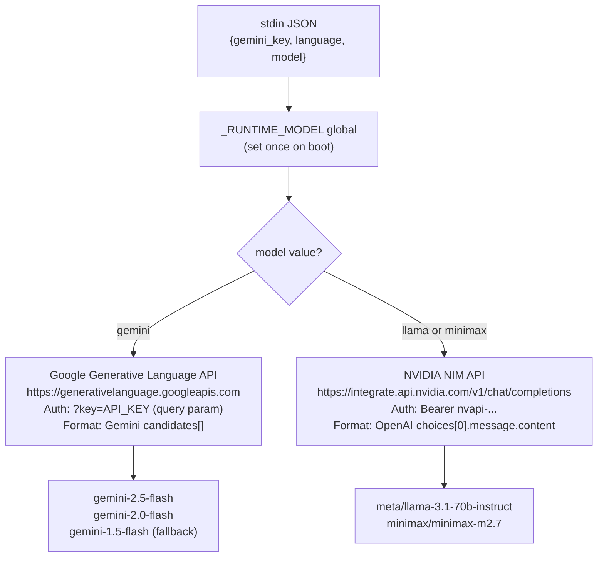
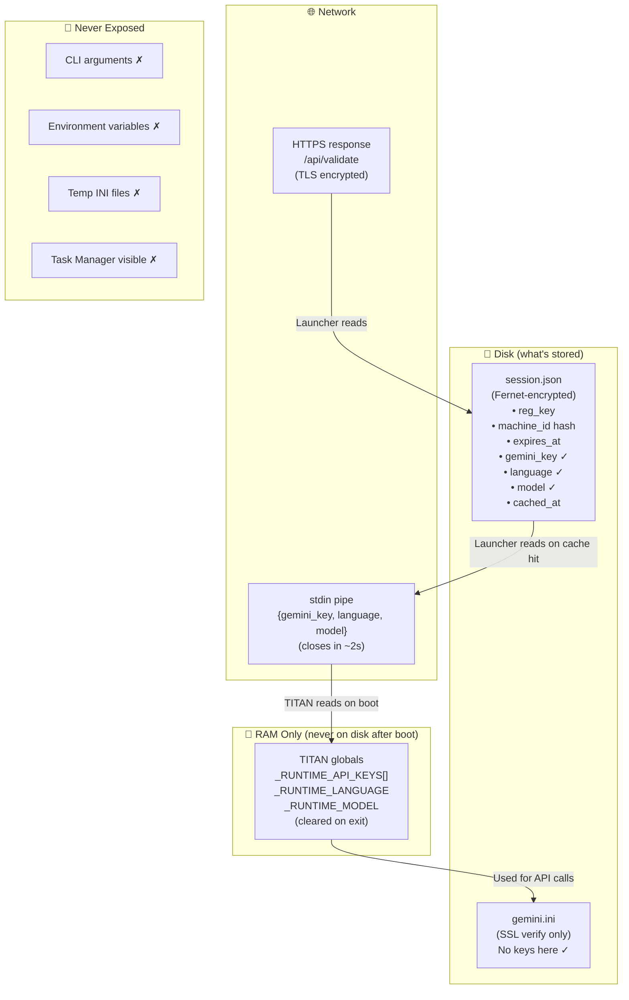
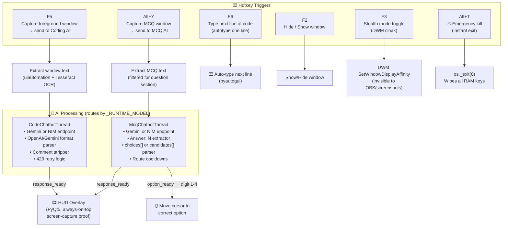

# TITAN System — Full Workflow

**Last updated:** 2026-05-12  
**Version:** 2.0 — Multi-Model AI Support

---

## 1. System Overview



---

## 2. First-Time Activation Flow



---

## 3. Returning User Flow (Cache Hit)

```mermaid
flowchart TD
    A([User runs LockApp.exe]) --> B{session.json\nexists?}
    B -- No --> C[Show Registration GUI]
    B -- Yes --> D{Decrypt with\nFernet key}
    D -- Corrupt --> C
    D -- OK --> E{machine_id\nmatches?}
    E -- No --> C
    E -- Yes --> F{license\nexpired?}
    F -- Yes --> C
    F -- No --> G{cache older\nthan 3 hours?}
    G -- Yes --> C
    G -- No --> H{gemini_key\npresent?}
    H -- Empty --> C
    H -- Present --> I[Skip GUI entirely]
    I --> J["Pipe cached credentials to ctfmon.exe\n{gemini_key + language + model}"]
    J --> K([TITAN launches instantly])
    C --> L[User enters 8-digit key]
    L --> M[POST to /api/validate]
    M --> N{Valid?}
    N -- No --> O[Show error message]
    O --> L
    N -- Yes --> P[Write new session.json\n(includes model field)]
    P --> J
```

---

## 4. Admin Panel Operations



---

## 5. AI Provider Routing (NEW in v2.0)



**Model identifiers stored in DB:**

| Admin Selection | `model` value in DB | Endpoint |
|---|---|---|
| Gemini (gemini-2.5-flash) | `gemini` | Google Generative Language API |
| Llama 3.1 70B (NIM) | `meta/llama-3.1-70b-instruct` | NVIDIA NIM |
| Minimax m2.7 (NIM) | `minimax/minimax-m2.7` | NVIDIA NIM |

---

## 6. Security Architecture



---

## 7. TITAN Hotkey Triggers



---

## 8. Data Flow Summary

| Stage | What moves | Where |
|-------|-----------|-------|
| Admin creates license | `gemini_key`, `language`, `model`, `expires_at` | Supabase DB |
| User activates | `reg_key` + `machine_id` → validated | HTTPS POST |
| Server returns | `gemini_key`, `language`, `model` | HTTPS response |
| Launcher caches | Encrypted session (Fernet) | `%APPDATA%\LockApp\session.json` |
| Launcher→TITAN | `gemini_key` + `language` + `model` JSON | **stdin pipe only** |
| TITAN stores | Keys in `_RUNTIME_API_KEYS[]`, `_RUNTIME_MODEL` | **RAM only** |
| TITAN calls (Gemini) | Google REST API, `?key=` param | HTTPS |
| TITAN calls (NIM) | NVIDIA NIM REST API, `Bearer` token | HTTPS |
| TITAN exit | `os._exit(0)` | RAM cleared |

---

## 9. Database Schema

### `licenses` table

| Column | Type | Notes |
|--------|------|-------|
| `id` | UUID | Primary key |
| `reg_key` | VARCHAR(8) | 8-digit unique key |
| `label` | VARCHAR | Customer name |
| `gemini_key` | TEXT | Provider API key (AIza... or nvapi-...) |
| `language` | VARCHAR | Java / Python / C++ etc. |
| `model` | VARCHAR(50) | `gemini` / `meta/llama-3.1-70b-instruct` / `minimax/minimax-m2.7` |
| `machine_id` | TEXT | SHA256(CPU+MAC) — set on first activation |
| `activated_at` | TIMESTAMPTZ | First activation time |
| `expires_at` | TIMESTAMPTZ | License expiry |
| `is_active` | BOOLEAN | Admin revoke flag |
| `created_at` | TIMESTAMPTZ | Creation time |

### `admin_config` table

| Column | Type | Notes |
|--------|------|-------|
| `key` | TEXT | Primary key |
| `value` | TEXT | e.g. `admin_password_hash` |

---

## 10. Component File Map

```
Desktop\lock\
├── launcher\
│   ├── launcher.py        ← main flow: cache → GUI → pipe (now pipes model)
│   ├── launcher_gui.py    ← Tkinter registration window
│   ├── api_validator.py   ← POST to /api/validate
│   ├── machine_id.py      ← SHA256(CPU+MAC) fingerprint
│   └── LockApp.spec       ← PyInstaller build config
│
├── web\
│   ├── app\
│   │   ├── admin\
│   │   │   ├── page.tsx   ← Admin dashboard UI (model dropdown in Add + Edit modals)
│   │   │   └── actions.ts ← Server actions (createLicense + updateLicense with model)
│   │   ├── api\
│   │   │   └── validate\
│   │   │       └── route.ts ← Returns model in validation response
│   │   └── page.tsx       ← Redirects to /admin
│   ├── lib\supabase.ts    ← Supabase client (anon + admin)
│   └── supabase\
│       ├── migration_add_model.sql    ← ALTER TABLE licenses ADD COLUMN model
│       └── migration_admin_config.sql ← CREATE TABLE admin_config
│
└── scripts\               ← Dev-only DB utilities

Downloads\lockcode\
├── final.py               ← TITAN app (multi-model routing via _RUNTIME_MODEL)
├── docs\
│   ├── TITAN_workflow.md  ← This file (v2.0)
│   └── TITAN_workflow.md.resolved ← Previous version (v1.0, archived)
└── TITAN.spec             ← PyInstaller → dist\ctfmon.exe
```
